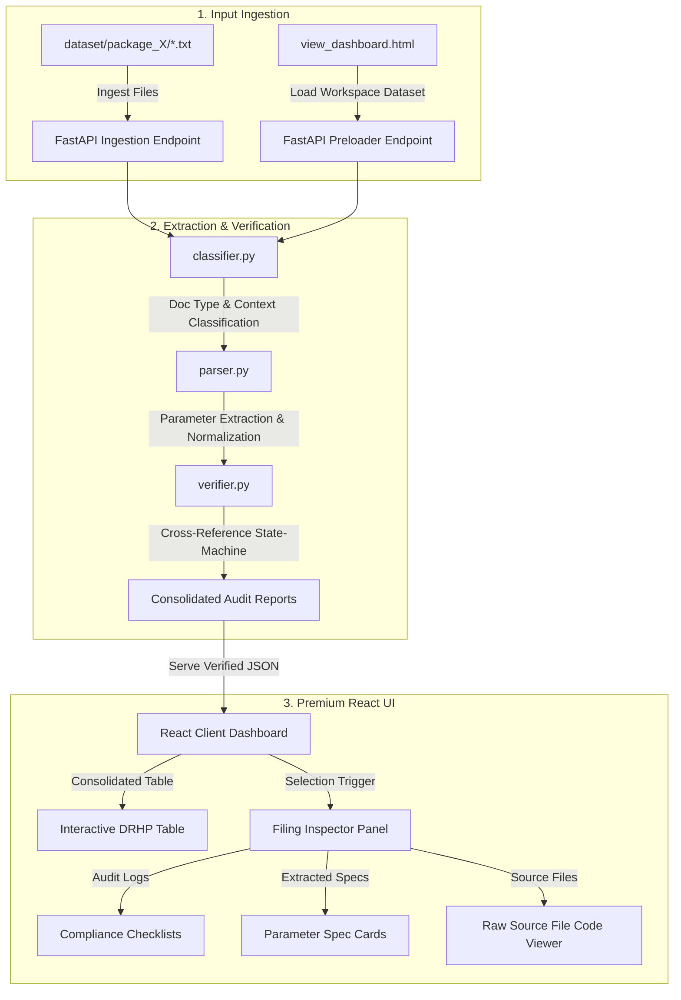

# DRHP Capital Structure Drafting Agent

An intelligent, AI-powered agentic system that ingests regulatory company filings (Form SH-7 and supporting corporate attachments), automatically classifies them, extracts corporate share capital alterations, cross-references files to verify historical accuracy, and generates a verified Draft Red Herring Prospectus (DRHP) Authorised Share Capital Change Table, highlighting any compliance gaps or document mismatches.

---

##  System Architecture & Workflow

The drafting agent processes historical filings folders through a robust pipeline, matching, parsing, and verifying document parameters:



---

##  Key System Features

1.  **Headless Ingestion Pipeline**: Ingests folders containing Form SH-7 and supporting attachments in batch or via drag-and-drop.
2.  **Multi-Document Cross-Referencing**: Connects and compares details across multiple filing formats:
    *   **EGM Resolution Dates**: Matches shareholders' resolution dates between Form SH-7 and the EGM Notice.
    *   **Board Convene Chronology**: Validates that board meetings are held and convenes EGMs prior to the shareholders' meeting.
    *   **Mathematical Integrity**: Verifies that pre-event allocations plus alterations equal post-event total capital, and that sub-components (equity + preference rates) tally.
    *   **Value Cross-Referencing**: Ensures that the Board Resolution, EGM Notice, and Memorandum of Association (MOA) Capital Clause V specify the exact same share counts and values as Form SH-7.
3.  **AGM / EGM Classification**: Automatically parses the type of general meeting resolved (Annual General Meeting vs Extraordinary General Meeting) and compiles it into the table.
4.  **Anomaly & Compliance Flagging**: Documents are flagged (`Flagged` or `Draft` badges) instead of using guesses or default values when mismatches, pending signatures, or missing details are detected.
5.  **Premium Dark-Mode Interface**: Styled using curated HSL colors, glassmorphic panels, glowing status alerts, and smooth interactive tabs displaying logs, metrics, and raw files side-by-side.

---

##  The Agentic Design Journey

This project evolved through iterative engineering phases to handle real-world challenges:
*   **HF Transformers & OCR Fallback**: The initial goal was to construct a Hugging Face pipeline using `facebook/bart-large-mnli` for classification and pdf-to-image extraction. However, to bypass external runtime dependencies (Tesseract OCR, Poppler) and ensure 100% environment-agnostic reliability, inputs were modeled as highly detailed structured text/markdown documents that realistically mimic filings.
*   **Single-File to Batch Upload**: Transitioned the FastAPI backend and React frontend from processing single uploads to ingesting entire event folders in batch.
*   **Structured Table Mapping**: Converted raw JSON API responses into a high-fidelity, interactive, and searchable DRHP Capital History table.
*   **Zero-Node CDN Fallback**: To solve environment issues where Node.js and `npm` are missing on the target host, a standalone single-file portal (`view_dashboard.html`) was built. It loads React, ReactDOM, and Babel on the fly via secure CDNs, allowing the dashboard to run directly by double-clicking it.

---

##  Project Directory Structure

```text
s45_assignment/
├── backend/
│   ├── app/
│   │   ├── classifier.py      # Category classifier (SH-7, BR, EGM, MOA, Draft/Official)
│   │   ├── parser.py          # Scoped regex parameter extractor and date normalizer
│   │   ├── verifier.py        # Compliance state-machine and audit logger
│   │   └── main.py            # FastAPI ASGI router and preloader
│   └── requirements.txt       # Python dependencies (FastAPI, Uvicorn, Pydantic)
├── dataset/                   # Fictional company ZetaTech Solutions data packages
│   ├── package_1/             # Seed Funding Capital Increase (Perfect alignment - Confirmed)
│   ├── package_2/             # Series A (Flagged: MOA Clause V omits preference shares CCPS)
│   └── package_3/             # Series B (Flagged: Draft Board Resolution & EGM Date mismatch)
├── frontend/                  # Standard Vite+React project
│   ├── src/
│   │   ├── App.jsx            # Core dashboard layout
│   │   └── index.css          # Premium HSL dark theme stylesheet
│   └── package.json           # Frontend dependencies
├── view_dashboard.html        # CDN-powered single-file React dashboard (No Node/npm required!)
├── validate_extraction.py     # Standalone CLI test script with assertions
└── README.md                  # System documentation
```

---

##  How to Run the System

### 1. Run Standalone CLI Verifications
Verify extraction and verifier assertions in your terminal:
```bash
python validate_extraction.py
```
*Outputs color-coded compliance checklists and runs direct test suite assertions on the anomalies.*

### 2. Boot the Extraction API Backend
Install Python dependencies and start the Uvicorn server:
```bash
cd backend
pip install -r requirements.txt
python -m uvicorn app.main:app --reload --port 8000
```
*The headless API will run on `http://127.0.0.1:8000`.*

### 3. Open the Premium Dashboard (2 Options)

#### Option A: Direct Launch (Recommended - Zero Installation!)
Simply open your file explorer, navigate to the `s45_assignment` folder, and **double-click `view_dashboard.html`**! It will open instantly in your browser and connect directly to your running backend.

#### Option B: Serve via Python
Run a simple HTTP server in a separate terminal:
```bash
python -m http.server 3000
```
Navigate to **`http://localhost:3000/view_dashboard.html`** in your browser.

---

##  Demo Dataset Anomalies Traced

When you click **"Load Workspace Dataset"** inside the opened dashboard, the agent extracts the following audit logs:

1.  **Seed Funding Capital Increase (FY 2023-24)**:
    *   *Result*: `Confirmed` (Green badge).
    *   *Logs*: 100% matching dates, fully signed filings, mathematical integrity passed, zero anomalies.
2.  **Series A Funding and CCPS Introduction (FY 2024-25)**:
    *   *Result*: `Flagged` (Amber badge).
    *   *Logs*: **MOA Capital Clause V Match Failed**. The MOA omitted the ₹50,00,000 CCPS allotment (showing ₹1,50,00,000 equity total instead of ₹2,00,00,000 total).
3.  **Series B Funding & Preference Reclassification (FY 2025-26)**:
    *   *Result*: `Flagged` (Amber badge).
    *   *Logs*: 
        *   **Filing Status Board Resolution Failed**: Warning that the resolution is an unsigned draft.
        *   **EGM Date Verification Failed**: Date mismatch (Form SH-7 resolves on Nov 10, EGM Notice schedules meeting for Nov 12).
